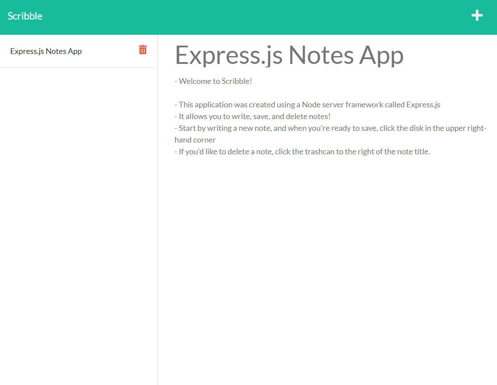

# Scribble - A Note Taking Application
  

  ## Description
>This note taking application allows users to write, save and delete notes easily. This app is a static webpage that is served by Express.js, and hosted by Heroku.

 > 

  ## Table of Contents
  * [Installation](#installation)
  * [Usage](#usage)
  * [Tests](#tests)
  * [Contributing](#contributing)
  * [License](#license)
  * [Questions](#questions)

  ## Installation
  >N/A

  ## Usage
  > You can use this application by navigating to the link below! 
  > [Take Some Notes!](https://dry-mesa-78992.herokuapp.com/)

  ## Tests
  >N/A

  ## Contributing
  >N/A

  ## License
  
  
  https://opensource.org/licenses/MIT 
    

  ## Questions
  GitHub: [t-starkw](https://github.com/t-starkw)  
  Email: tstark@gmail.com
